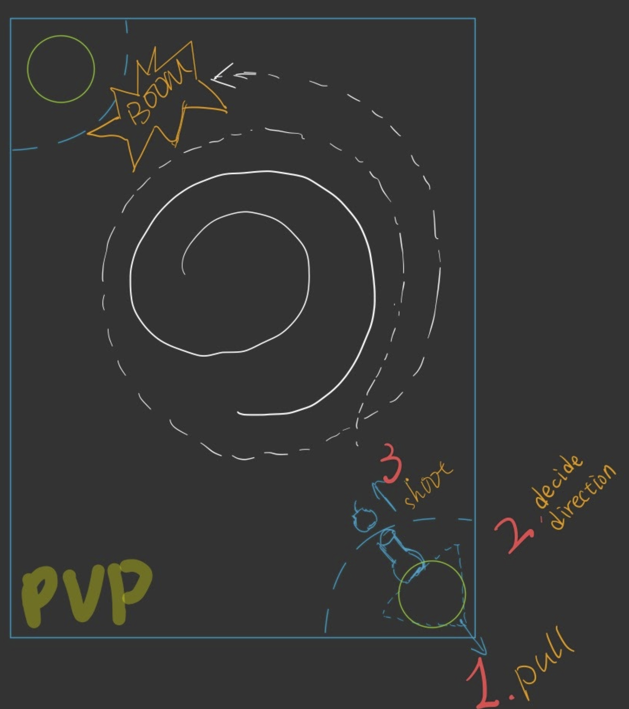
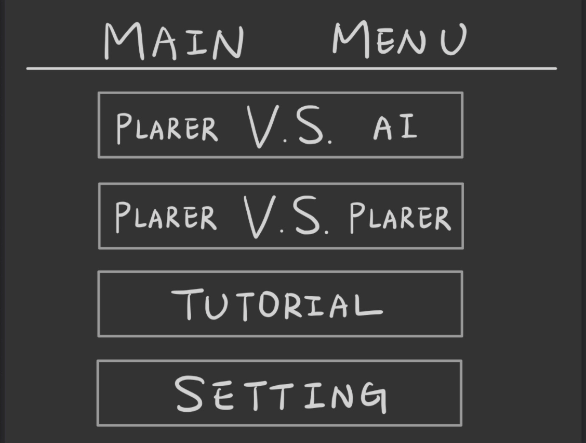
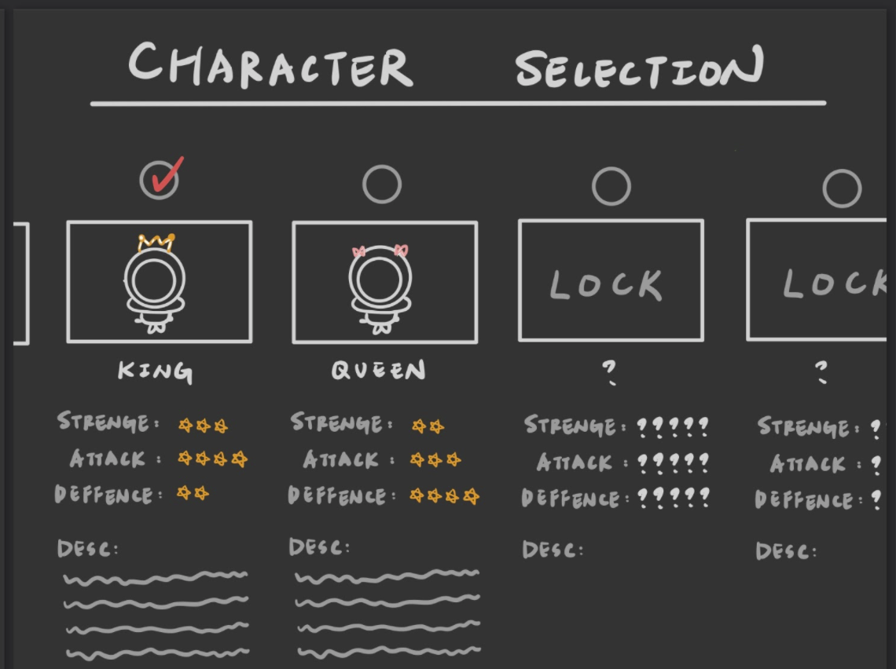
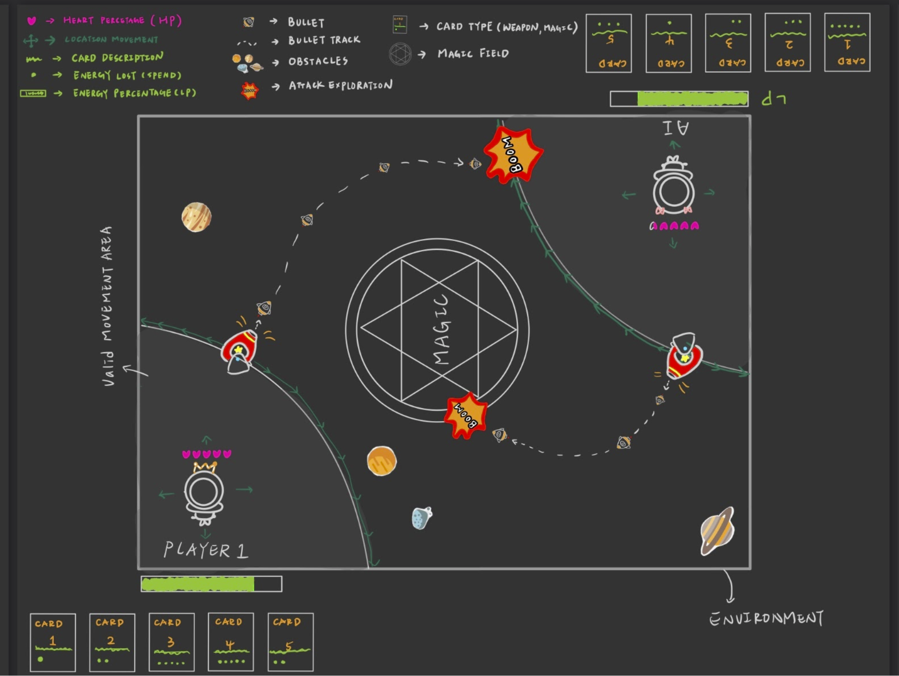

# ElementalWar (CSCI 526 2021 Fall)

## Game Overview
- ElementalWar is a turn-based pvp game with role-playing features.
- At the beginning, players will select their preferred characters, which different characters allow gaining different random buffs.
- The player who defeats the competitor will be the winner.

## Goals
- Compete against your opponent, and survive until the end of the game.
- A successful attack against the opponent will deduct the blood level of the opponent.
- When the blood level of the opponent reaches zero, the player is the winner.

## Details
- [Mechanics](docs/mechanics.md)
- [Maths](docs/maths.md)
- [Components design](docs/components_design.md)
- [Player](docs/player.md)
- [Game environment](docs/game_environment.md)
- [Card system](docs/card_system.md)

## Greybox sketch

## Prototype

